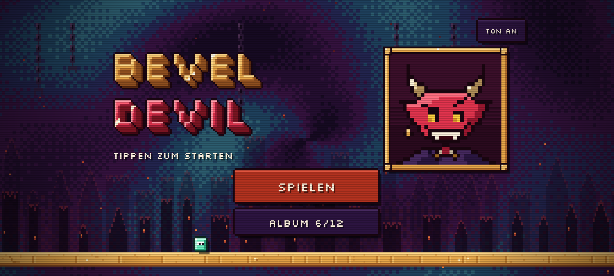
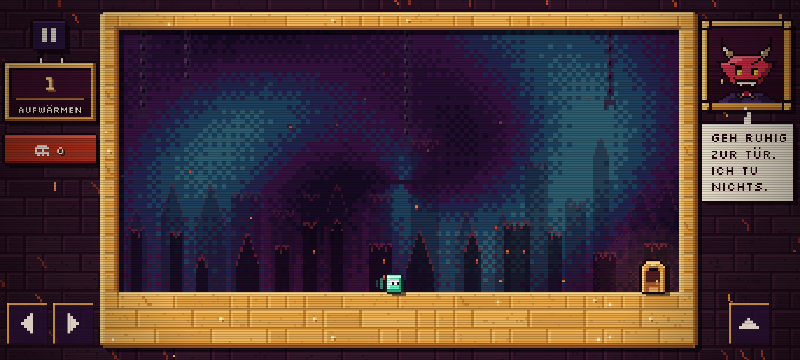
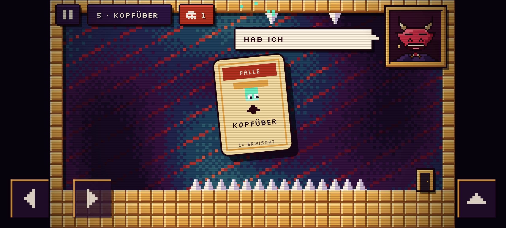
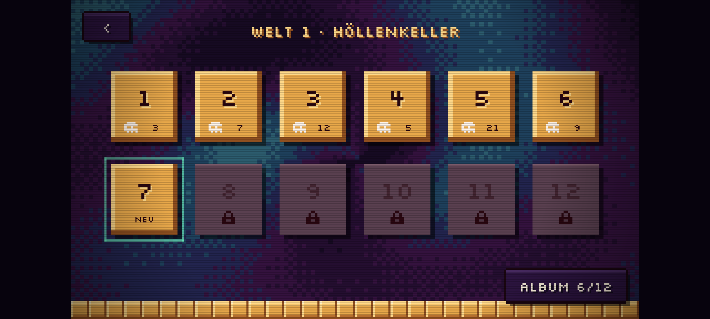
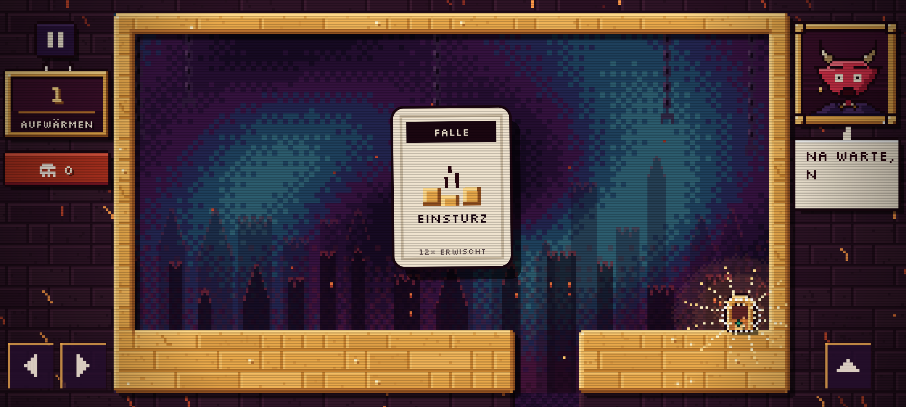
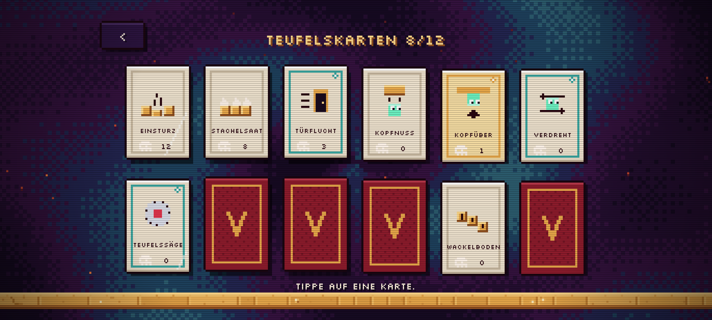

# Bevel Devil

Ein nativer Android-Troll-Platformer im „Höllen-CRT“-Look. Der kleine Würfel **Bevel** will zur Tür, und **Mephi**, der Croupier der Hölle, spielt ihm dabei Fallenkarten aus.

| Titel | Level 1 | Teufelskarte |
|---|---|---|
|  |  |  |
| **Levelwahl** | **Ab durch die Tür** | **Album** |
|  |  |  |

## Was drin ist

- **48 Level** in Welt 1 „Höllenkeller“, drei Akte à 16: **Die Karten** (die zwölf klassischen Tricks: Einsturz, Stachelsaat, fliehende Tür, Kopfnuss, Schwerkraft-Flip, vertauschte Steuerung, Teufelssäge, Geisterblock, Sinkflug, Attrappe, Wackelboden, Finale), **Neue Regeln** (blinkende Plattformen, Pfad-Sägen, der Idle-Trigger, erst einzeln, dann mit den Klassikern) und **Mephi schummelt** (Meta-Twists wie Fake-Abspann, ausweichender Pause-Knopf, Rahmenbruch, Kopfstand, Geister-Versuch; nur zwei Level nutzen Handy-Neigung und Schütteln; Finale „Abspann“). Dazu Nerd-Anspielungen von Segfault bis sudo.
- **Mephi** im goldenen Rahmen mit fünf Stimmungen (lauert, lacht, schmollt, entsetzt). Er kommentiert jeden Tod und jede Falle, auf Deutsch oder Englisch je nach Gerätesprache.
- **Teufelskarten:** Jede Falle wird als Karte ausgespielt, die aus Mephis Rahmen ins Bild fliegt. Gefundene Karten landen im Album, zusammen mit einem Zähler, wie oft sie dich erwischt haben.
- **Höllen-CRT-Look:** 256×144-Spielfeld (8 px pro Tile) in einem Pixelpuffer, der mit ganzzahliger Skalierung jedes Seitenverhältnis ohne Balken füllt, Farbstrudel mit Dithering, Bevel-Kanten, harte Schlagschatten, Scanlines und Vignette.
- **Mauerwerk statt Kacheln:** Berührende Blöcke verschmelzen per Autotiling zu Massen aus unregelmäßigen Goldsteinen, mit Bevel nur an freien Kanten. Fallen sind bis zum Auslösen pixelgleich mit normalem Boden (`TrapInvisibilityTest`).
- **Leben im Bild:** aufsteigende Glut, eine Parallax-Skyline der Hölle, glühende Risse im Fels, Türlicht, blitzende Spikes, Staubwolken, zersplitternder Würfel, Sog in die Tür und Dither-/Iris-Blenden zwischen Screens.
- Coyote-Time, Sprungpuffer, variable Sprunghöhe, Touch-Steuerung (Multitouch) sowie Tastatur und Gamepad.
- Synthetisierte Sounds, keine Audiodateien. Der Fortschritt wird lokal gespeichert. Release-APK rund 80 KB.

## Bauen

Voraussetzungen: JDK 17+ und ein Android-SDK (compileSdk 35). Mit Android Studio einfach das Projekt öffnen, oder:

```bash
./gradlew assembleDebug          # APK unter app/build/outputs/apk/debug/
./gradlew testDebugUnitTest      # Logik- und Screenshot-Tests
```

Die Screenshot-Tests rendern echte Screens mit Robolectric nach `app/build/screenshots/`. So lässt sich der Look ohne Gerät prüfen.

## Aufbau

```
app/src/main/java/com/robinrehbein/beveldevil/
├── game/            Reine Spiellogik, ohne Android-Abhängigkeiten
│   ├── Level.kt     Level-DSL: Karte, Glyphen, Trigger, Aktionen
│   ├── Levels.kt    Level-Register (alle Welten hintereinander)
│   ├── Worlds.kt    Welten: Name, Übergangsscreen, Index-Mapping ("2-17")
│   ├── World1*.kt   Die 48 Level von Welt 1 (Part1–Part3, ein Akt je 16 Level) und Bau-Helfer
│   ├── World.kt     Physik, Kollision, Fallen (ein Versuch)
│   ├── Game.kt      Screens, Mephis Stimmung, Karten, Fortschritt
│   ├── Cards.kt     Die Teufelskarten
│   └── Txt.kt       UI-Texte (DE/EN)
├── render/          Renderer, prozedurales Mephi-Sprite, Karten-Icons; `Theme.kt`: Look pro Welt (Welt 1 Höllenkeller, Welt 2 Rechenzentrum mit Stahl-Racks, LED-Hintergrund in `DataCenter.kt`; neue Welt = ein `Theme`)
├── audio/Sfx.kt     Chiptune-Synth
├── GameView.kt      Game-Loop (feste 120 Hz), Touch, Tastatur
└── MainActivity.kt
```

## Ein Level bauen

Level sind Daten. Die Karte ist 32×18 Tiles groß, der Spieler läuft normalerweise auf Zeile 14 (Bodenoberkante y = 15).

```kotlin
Level(
    name = T("Warm-up", "Aufwärmen"),
    intro = T("Go on, walk to the door.", "Geh ruhig zur Tür."),
    traps = listOf(
        trap(PastX(16.5f), Play(Card.COLLAPSE), Fall('a'), Say(T("Floor?", "Boden?"))),
    ),
) {
    border(); floor()
    fill(19..21, 15..17, 'a')          // Gruppe 'a' kann später einstürzen
    put(2, 14, 'P'); put(29, 14, 'D')  // Start und Tür
}
```

- `#` Block, `^ v < >` Spikes, `P` Start, `D` Tür.
- Kleinbuchstaben sind Block-Gruppen, Großbuchstaben Spike-Gruppen. Über `legend` lassen sie sich verstecken (`hidden`) oder erst beim Kopfstoß sichtbar machen (`bonk`).
- Trigger: `PastX`, `BeforeX`, `Zone`, `Touch`, `After`, `Idle(s)` (s Sekunden keine Eingabe), `Shaken` (Handy geschüttelt).
- Aktionen: `Fall`, `Show`, `Hide`, `Move`, `DoorTo`, `Gravity`, `Swap`, `Saw`, `Say`, `Shake`, `Play`, dazu die Mechaniken unten.
- `start = listOf(...)` führt Aktionen gleich beim Levelstart aus (sonst per Trigger).

Mechaniken (sichtbar, keine versteckten Fallen):

```kotlin
Blink('a', on = 1.8f, off = 1f, phase = 0f)       // Plattform blinkt; flackert rot vor dem Verschwinden,
                                                  // kommt nie im Spieler zurück (wartet, bis er raus ist)
PathSaw(6f, 16f to 14.4f, 16f to 9f, delay = 1.8f) // Säge auf Wegpunkten, Tiles/s, hin und her
PathSaw(4f, 23f to 11f, 26f to 11f, 26f to 13f, loop = true) // oder im Kreis
trap(Idle(1.2f), Fall('a'))                       // „Steh nicht nur rum“
Tilt('a', left = 0f, right = 13f, speed = 6f)     // Wasserwaage: Gruppe rutscht mit der Handyneigung
Slope(8f)                                         // Neigung schiebt Bevel bis 8 Tiles/s zur Seite
trap(Shaken, Hide('a'))                           // Schütteln
```

Neigung und Schütteln liest `GameView` nur in Leveln, die sie nutzen (Schwerkraftsensor, sonst Beschleunigungssensor). Ohne Sensor oder mit Einstellung „Neigung: Aus“ erscheinen unten zwei Neige-Tasten (einrastend) und eine Schütteltaste; Tastatur Q/E neigen, S schüttelt. Im `Bot` gibt es dafür `tilt(v)` und `shake()`. Mini-Level für jede Mechanik liegen in den Tests (`Demo.kt`).

### Meta-Twists

Fallen, die das Spiel selbst angreifen, jeweils opt-in pro Level (Logik in `game/Twists.kt`, Look in `render/TwistPainter.kt`):

```kotlin
trap(AtDoor, FakeWin(FakeEnd.CREDITS, 'c', DoorTo(1, 8)))  // Fake-Abspann; die letzten Zeilen werden Gruppe 'c'
trap(AtDoor, FakeWin(FakeEnd.CLEAR, null, Hide('f')))     // Fake-„GESCHAFFT!“, danach fehlt der Boden
trap(After(0.3f), PauseTrap(PauseTrick.DODGE))            // Pause-Button weicht aus (auch SPIKE, SWAP)
trap(Resumed(), Hide('w'))                                // feuert nach Pause + Weiter
trap(PastX(4f), FrameCrack(16, 0, 19, 0, warn = 0.9f))   // Stück vom Goldrahmen bricht ab und fällt
trap(PastX(6f), Flip(3f))                                 // Bild steht 3 s Kopf
trap(PastX(21f), Roll(1.2f))                              // CRT verliert den Bildfang
trap(After(0f), Ghost(1f))                                // letzter Versuch läuft als tödlicher Geist mit
```

- `AtDoor` feuert statt des Siegs; ein Fake-Sieg speichert nichts, zählt nichts und schaltet nichts frei. Danach spuckt die Tür Bevel wieder aus (kurz gesperrt).
- Pause bleibt immer echt erreichbar: Zurück-Taste und App-Wechsel pausieren unabhängig vom Trick, und im Pausemenü setzt ein Tipp neben die Buttons fort.
- `Flip` ist nur optisch; links/rechts folgen dem Bildschirm (drückt man rechts, läuft Bevel auf dem Kopfstand-Bild nach rechts), Springen bleibt Springen.
- Demo-Level für jeden Twist liegen nur in den Tests (`TwistsTest`).

Jedes Level hat in `World1Test` einen Bot, der es mit der echten Physik durchspielt. Wer ein Level ändert, sieht sofort, ob es noch lösbar ist.

## Lizenzen

Pixel-Schrift: [Silkscreen](https://github.com/googlefonts/silkscreen), SIL Open Font License 1.1 (siehe `licenses/`).
